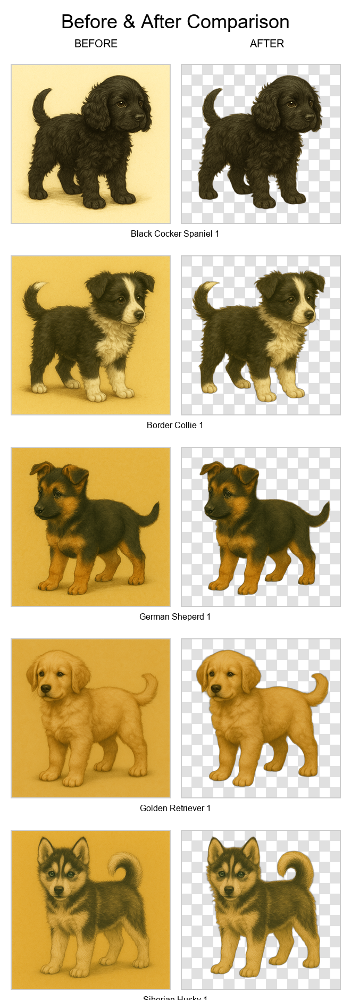

# SpriteCleaner - Background Removal Tool

Professional Python script to remove backgrounds from PNG images, making them transparent while preserving the original subject perfectly.



## Quick Start

```bash
# Install dependencies (one time)
pip install -r requirements.txt

# Process images
python remove_background.py -i input_folder -o output

# Process single file
python remove_background.py -i image.png -o output.png

# Generate before/after comparison
python compare_images.py
```

## Features

- 🎯 High accuracy AI-powered background removal
- 🖼️ Preserves original subject without cutting or cropping
- 🔄 Process single files or entire folders
- 🎨 Multiple AI models available
- ⚡ Optimized batch processing
- 📊 Before/After comparison tool with interactive HTML viewer

## Usage Examples

```bash
# Basic batch processing
python remove_background.py -i ../assets/dogs -o ./output

# Use faster model
python remove_background.py -i input.png -o output.png -m u2netp

# Use highest quality model
python remove_background.py -i input.png -o output.png -m birefnet-general
```

## Available Models

- `u2net` (default) - General purpose, high quality
- `u2netp` - Lightweight, faster processing
- `birefnet-general` - Highest quality
- `isnet-general-use` - High quality alternative

## Options

```
-i, --input    Input file or folder path (required)
-o, --output   Output file or folder path (required)
-m, --model    Model to use (default: u2net)
-h, --help     Show help
```

## Output

- Creates new PNG files with transparent backgrounds
- Folder processing adds `_no_bg` suffix
- Original images are never modified
- First run downloads model (~176MB, cached)

## Comparison Tool

The project includes a comparison tool that generates before/after visualizations:

```bash
python compare_images.py
```

This generates:
- `comparison_grid.png` - A visual grid comparing all 5 template images
- `comparison.html` - An interactive HTML viewer with side-by-side comparisons

The tool uses the 5 template images from the `/input` directory:
- Black Cocker Spaniel
- Border Collie
- German Shepherd
- Golden Retriever
- Siberian Husky

## Requirements

- Python 3.10+
- Dependencies in requirements.txt
